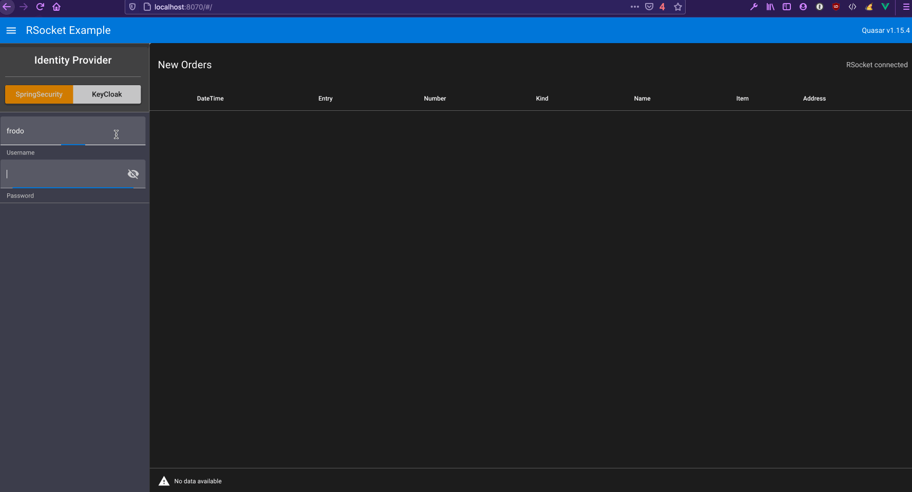
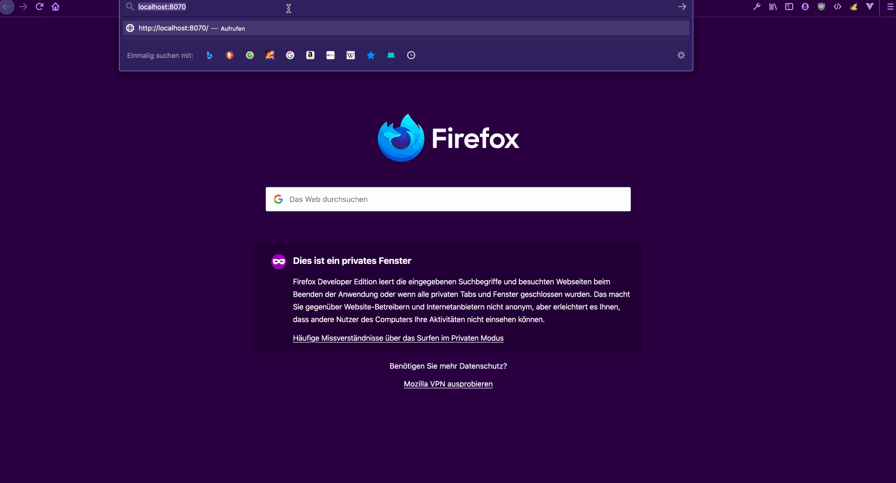

# SpringCloud Gateway RSocket Example

## What is RSocket ? 

Check out the official docs: [RSocket Docs](https://rsocket.io/docs/)

> Most interesting:
>>Network communication is asynchronous. The RSocket protocol embraces 
>>this and models all communication as multiplexed streams of messages 
>>over a single network connection, and never synchronously blocks while 
>>waiting for a response

In this example I am using a SpringCloud Gateway to demonstrate how
RSocket communication works over **WebSocket** with an **[rsocket-js](https://github.com/rsocket/rsocket-js)**
client and **VueJS** frontend.

## Motivation

We'd like to use a **single** websocket *endpoint/broker* for multiple services.
The *normal* spring integration with *STOMP over WebSocket* cannot be used on the
reactive stack. Therefore, I had to take a deeper look into RSocket.

## The Example

The server is creating scheduled *order* events which are added to a stream, those can 
be retrieved using a *HTTP GET* or *RSocket Request Stream*.

There are two *kind* of order, LOTR (Lord of the Rings) order and GOT (Game of Thrones) order,
to demonstrate how *routes* & *security* can be handled.
The order event is a *order* with random *kind* (either GOT or LOTR).

For now this example is just using the *REQUEST_STREAM* frame, but could be easily extended.

The decision about **who retrieves which data** is made based on the users *authorities*.

## Demo

#### SpringSecurity



#### KeyCloak



## Security

This example can be used with two different *Identity Providers*:

- SpringSecurity
- [KeyCloak](https://www.keycloak.org/)

Those can be easily switched trough using profiles.

### Users

| Username | Password | Role        | Can access/retrieve orders |
|----------|----------|-------------|----------------------------|
| admin    | admin    | ADMIN       | ALL                        |
| frodo    | frodo    | MIDDLEEARTH | LOTR                       |
| john     | john     | WESTEROS    | GOT                        |

To administrate the KeyCloak use *username: kcadmin* and *password: kcadmin*.

#### Spring Security

Routes and endpoints requested via **basic auth**.

#### KeyCloak

Routes are requested via **bearer auth** (where the JWT is obtained before the request is made)
and endpoints are handled by the *SpringCloudGateway* which holds the authentication (OAuth2 client).

## Test it

Either use the checked in IntelliJ run-configuration in *.run* or launch it manually.

### Server (Maven v3.6.3)


#### SpringSecurity

```shell
$ mvn clean package
$ cd target/
$ java -jar gateway-rsocket-websocket.jar
```

#### KeyCloak

Run the KeyCloak using `docker-compose up` and start the server afterwards:

```shell
$ mvn clean package
$ cd target/
$ java -jar -Dspring.profiles.active=keycloak gateway-rsocket-websocket.jar
```

### Client (Node v14.16.0 & NPM v6.14.11)

```shell
$ cd frontend/
$ npm install
$ npm run dev
```

Now head over to the *frontend* served under **http://localhost:8070/** (routed by the gateway).

### Ports used

**Server:** 8070

**Client:** 8080

**KeyCloak:** 8060 (optional)

### Test with other tools

#### RSocket

For RSocket development I used [RSC](https://github.com/making/rsc) installed using:

```shell
brew install making/tap/rsc
```

**Note:** When using this tool whole frames sent are visible and also check out the server logs.

##### SpringSecurity

```shell
# Basic
$ rsc --stream --route=orders.all --sm simple:user:password --smmt MESSAGE_RSOCKET_AUTHENTICATION --debug ws://localhost:8070/server/rsocket
$ rsc --stream --route=orders.lotr --sm simple:user:password --smmt MESSAGE_RSOCKET_AUTHENTICATION --debug ws://localhost:8070/server/rsocket
$ rsc --stream --route=orders.got --sm simple:user:password --smmt MESSAGE_RSOCKET_AUTHENTICATION --debug ws://localhost:8070/server/rsocket

# With data (payload)
$ rsc --stream --route=orders.all --sm simple:user:password --smmt MESSAGE_RSOCKET_AUTHENTICATION --debug --data='{"rscclient":"request"}' ws://localhost:8070/server/rsocket

# With metadata
$ rsc --stream --route=orders.all --sm simple:user:password --smmt MESSAGE_RSOCKET_AUTHENTICATION --debug --metadata='{"data":"custom metadata value from rsc"}' ws://localhost:8070/server/rsocket
```

##### KeyCloak

Needs to be added...

#### HTTP

To retrieve the stream using *HTTP* I used [HTTPIE](https://httpie.io/) using:

##### SpringSecurity

````shell
http :8070/server/orders --stream --auth "user:password"
````

Use *HTTPie* to create orders:

```shell
# Random
http :8070/server/orders/new --auth "user:password"
# Specific
http :8070/server/orders/new kind==lotr --auth "user:password"
http :8070/server/orders/new kind==got --auth "user:password"
```

##### KeyCloak

Needs to be added...

## Next up

- [X] Payload integration
- [X] Custom metadata
- [X] Route with variable
- [X] SpringSecurity
- [ ] Multiple routes

## Disclaimer

We are pretty new to WebFlux and the whole *reactor* project, so this code might
not be optimized for being *non-blocking*, suggestions are welcome.

## Contributing

Each contribution, no matter in what, is highly appreciated!
